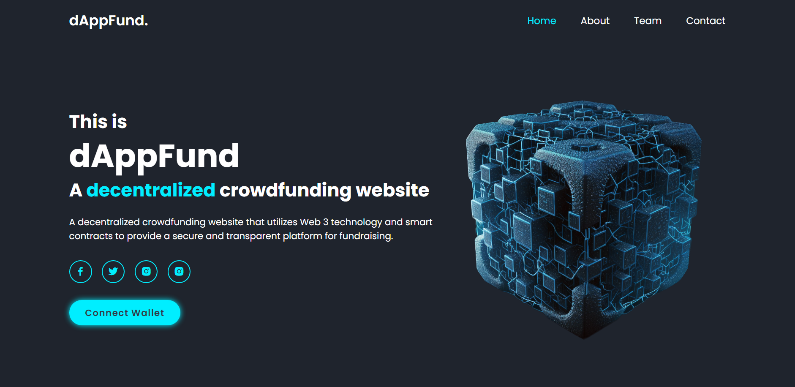
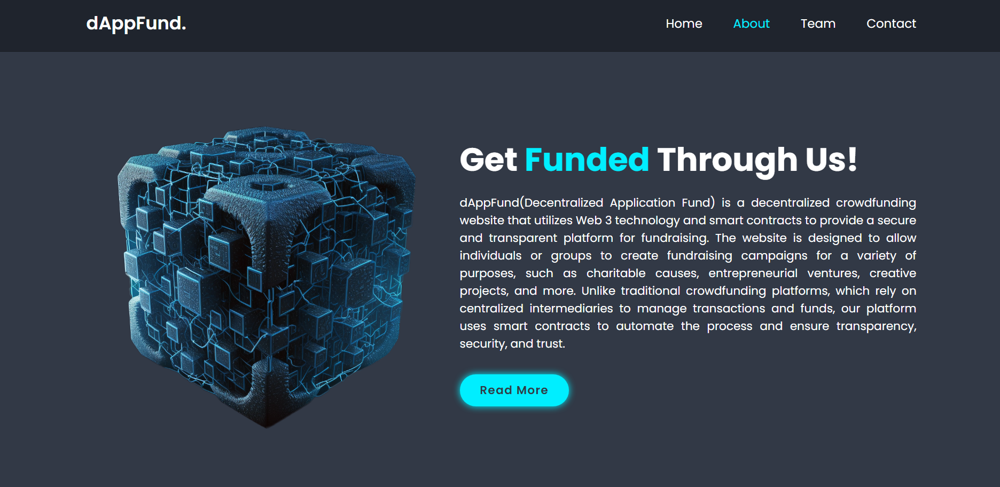
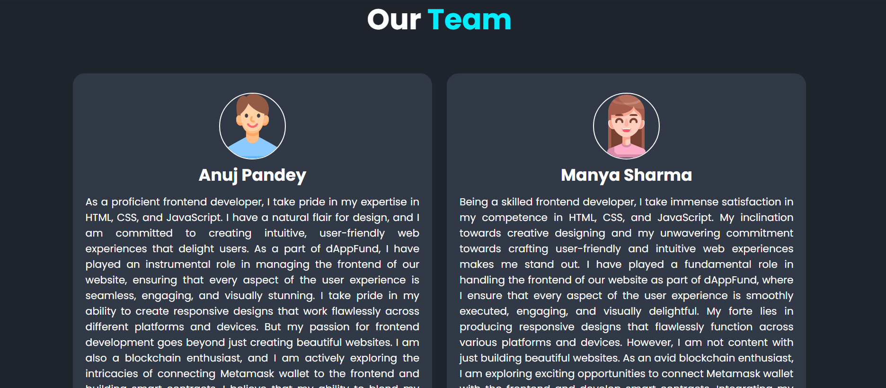
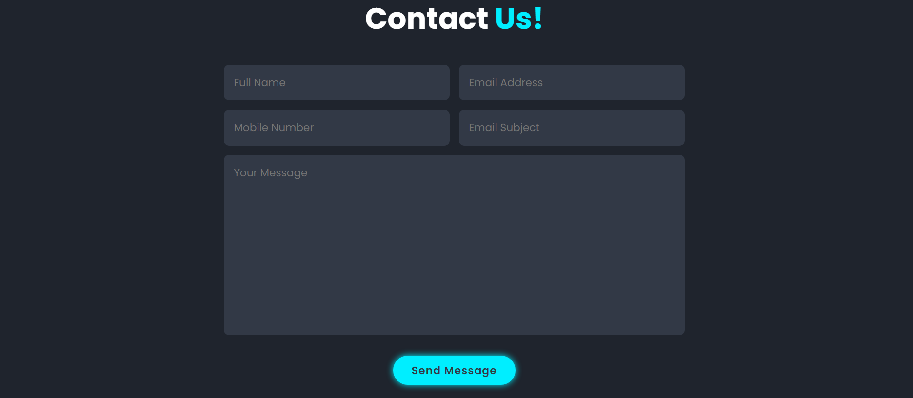

# dAppFund

Supporting Entrepreneurship with Decentralized Pre-Seed Funding.

## Problem Statement
Securing funding for pre-seed startups is often a challenging and time-consuming process. Traditional funding sources such as venture capitalists and angel investors typically require startups to give up equity and control of their company in exchange for funding. Additionally, these traditional sources may not always be accessible to entrepreneurs from certain geographic locations or those who lack established networks.

Despite the increasing popularity of blockchain technology, startups still face significant challenges in securing funding, particularly at the pre-seed stage. Traditional funding models can be slow and opaque, leading to delays and inefficiencies in the fundraising process. Additionally, startups often face high barriers to entry and lack access to investors who can provide the resources they need to succeed.

The lack of transparency and accessibility in the traditional funding model has created a funding gap for many pre-seed startups, hindering their ability to grow and innovate. As a result, there is a pressing need for a decentralised blockchain-based platform that can provide startups with access to a wider pool of investors and streamline the fundraising process.
## Solution
Our project, "dAppFund", aims to bridge this gap by creating a blockchain-based platform that connects pre-seed startups with investors in a transparent manner. By leveraging the power of blockchain technology, we can ensure that startups receive the funding they need to bring their ideas to life, while also providing investors with greater access to promising projects

The platform will allow startups to create a project proposal and apply for funding. Investors will have access to top-performing startups that meet our selection criteria and can then review the proposals and choose to invest in the startups they find promising. The funding process will be carried out using cryptocurrency, and the platform will allow for transparent and secure transactions using Metamask.

Our platform provides a simple and user-friendly interface that allows pre-seed startups to submit their investment proposals through a contact form. Once we receive a proposal, our team will conduct a thorough investigation of the startup and verify its authenticity. We will then list the startup on our website with all the relevant details, including project descriptions, financial projections, and team bios, so that investors can easily review and fund them.

We will also use a calculated valuation approach to generate specific tokens for each pre-seed startup. These tokens can then be exchanged or sold on different cryptocurrency platforms, providing liquidity and flexibility to investors.

Overall, dAppFund is a game-changer in the pre-seed fundraising space, empowering startups and investors alike to drive innovation and growth.

## Methodology

While developing our ICO, our main focus was to make it secure and user-friendly. To achieve this, we chose to use the standard ERC20 token template to create a fungible token.
Our tokens are built on Solidity, a popular programming language for developing smart contracts on the Ethereum blockchain. To ensure the quality and reliability of our code, we rigorously tested it multiple times using the Remix IDE. This allowed us to identify and address any issues or bugs before deployment, ensuring a smooth and secure user experience for our investors.
This allowed us to establish a strong foundation for our token design and ensure its compatibility with other platforms. In addition, we built our website using HTML, CSS, and Javascript to create an intuitive and easy-to-navigate user interface. Our aim was to make the ICO accessible and understandable to everyone, regardless of their technical background.

For companies looking to create an ICO for initial fundraising, it is essential to submit a clear and compelling explanation of their product's ideology. This helps in backing their valuation and token value.

## ICO Creation

ICO Token Smart Contract :

- STEM Token (Polygon Mumbai Testnet) :  

Contract Address : 0x592314F1F1446c0c3162A6C62de94F819F67F1600
[Polygon Scan Link](https://mumbai.polygonscan.com/token/0x592314F1F1446c0c3162A6C62de94F819F67F160)

- dAppCoin (DC) Token (Sepolia Testnet) :  

Contract Address : 0x71D1362976eC32D57b6ef1ea504A9657F44E6e0F
[EtherScan Link](https://sepolia.etherscan.io/token/0x71D1362976eC32D57b6ef1ea504A9657F44E6e0F)

## Tech Stacks

<table border="0">
        <tr>
            <th>HTML</th>
            <th>CSS</th>
            <th>JavaScript</th>
            <th>PHP</th>
            <th>SOLIDITY</th>
            <th>GOOGLE CLOUD & AMD INSTANCE</th>
            <th>FIREBASE</th>
            <th>Dialogflow</th>
        </tr>
        <tr>
            <td></td>
            <td></td>
            <td></td>
            <td></td>
            <td></td>
            <td>
                
            </td>
            <td></td>
            <td></td>
        </tr>
    </table>

Frontend:

	1.1. Our website is built using a combination of modern web dev technologies that helped us achieve a seamless user experience.
    
    1.2. We used pure HTML and CSS to structure and design the frontend of our website. 
    
    1.3. JavaScript was utilized to add dynamic functionalities and interactivity to our web pages, making them more engaging and 
    user-friendly.

Backend:

	2.1. We created our own ERC20 token “dAppCoin(DC)” using Solidity programming language and rigorous testing of the smart 
    contract was conducted on Remix IDE, using various testnets such as Sepolia and Polygon Mumbai.
    
    2.2. We then deployed them using HardHat, an open-source development environment for building and testing smart contracts.
    

Google Cloud Service:

	3.1. We opted for GCP AMD Instance T2D for the deployment of our website. The T2D instances were preferred over N2D as they
    are suitable for general-purpose workloads that require consistent performance and also due to their lower cost and 
    sufficient performance for most general-purpose workloads.
    
    3.2. We have integrated Firebase(A Google Cloud Service), which is a set of backend cloud computing services and application
    development platforms provided by Google Cloud, for our Investor Login and SignUp feature.
    
    3.3. We used Dialogflow to develop our chatbot that facilitates investor navigation on our website and offers assistance in 
    answering common questions related to the services we provide.

Conclusion:

	Our tech stack represents a perfect blend of frontend and backend technologies that work together seamlessly to provide
    our users with a seamless experience.

## Authors

- [@Manya Sharma](https://github.com/manya706)
- [@Anuj Kumar Pandey](https://github.com/codermal7)

## Resources 
https://towardsdatascience.com/applied-machine-learning-models-for-improved-startup-valuation-a7b180fee127
https://www.turing.com/kb/synthetic-data-generation-techniques
https://docs.investory.io/en/articles/6172037-investor-s-api-beta
https://www.investopedia.com/articles/financial-theory/11/valuing-startup-ventures.asp#:~:text=Discounted%20Cash%20Flow%20(DCF)&text=Discounted%20cash%20flow%20analysis%20then,that%20cash%20flow%20is%20worth.

