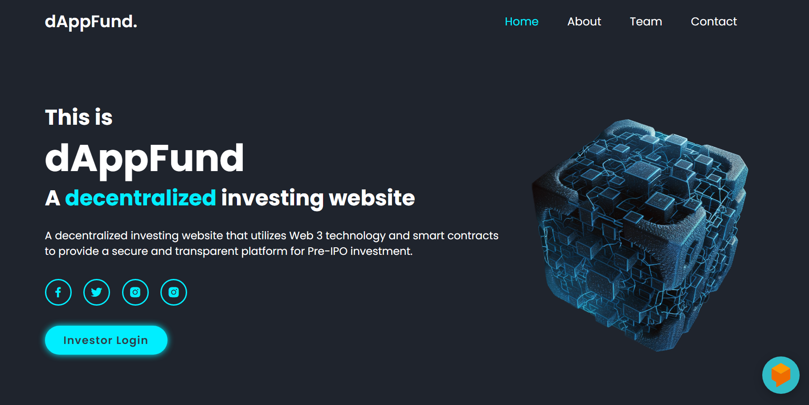

# dAppFund

Web3 based Secure Investing Website for Startups.

dAppFund(Decentralized Application Fund) is a decentralized investing website that utilizes Web 3 technology and smart contracts to provide a secure and transparent platform for fundraising. The website is designed to allow individuals or groups to create fundraising campaigns for a variety of purposes, such as charitable causes, entrepreneurial ventures, creative projects, and more. Unlike traditional investing platforms, which rely on centralized intermediaries to manage transactions and funds, our platform uses smart contracts to automate the process and ensure transparency, security, and trust.

Basically, smart contracts are self-executing programs that run on a blockchain network, such as Ethereum. They act as a set of rules and conditions that govern the behaviour of the platform, allowing users to interact with each other and with the platform in a decentralized manner. This means that the platform operates without the need for a central authority, reducing the risk of fraud and improving the efficiency of the process.

The platform will be built on a decentralized network, meaning that will operates without a central authority or intermediary. Instead, the platform uses smart contracts, which are self-executing computer programs that are stored on a blockchain, to manage and automate the fundraising process.

Users who wish to create a campaign on the dAppFund platform would need to register with an Ethereum wallet, which will allow them to create a smart contract that outlines the details of their campaign, including the funding goal, the duration of the campaign, and the terms of the fundraising. Once the smart contract is created, it will be uploaded to the Ethereum network, where it will be visible to potential backers.

Backers who wish to support a campaign can view the available campaigns on the dAppFund platform and contribute to them by sending Ethereum to the corresponding smart contract. The smart contract will automatically release the funds to the campaign creator when the funding goal is reached. If the funding goal is not reached within the specified time frame, the smart contract will automatically return the contributed funds to the backers.

One of the main advantages of dAppFund is that it provides a transparent and secure fundraising process, as all transactions are recorded on the blockchain, and the smart contracts are designed to operate automatically, without the need for a central authority or intermediary. This reduces the risk of fraud or mismanagement and provides greater accountability and transparency for both campaign creators and backers.

Overall, the dAppFund project aims to leverage the power of Web 3 and blockchain technology to provide a decentralized and secure platform for crowdfunding, promoting innovation and collaboration while minimizing the risk of fraud and misuse of funds.
## Authors

- [@Manya Sharma](https://github.com/manya706)
- [@Anuj Kumar Pandey](https://github.com/codermal7)

